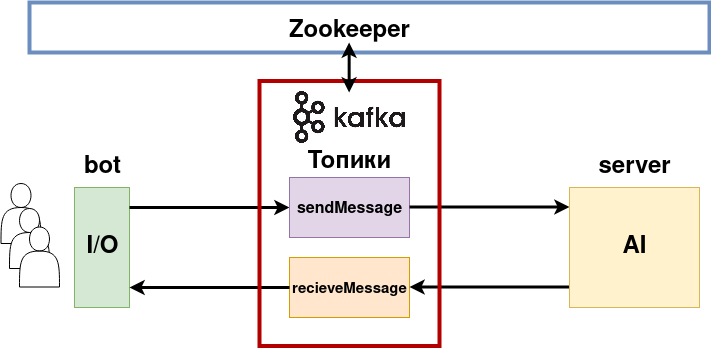

# Классификация настроения текста
Телеграм Бот, определяющий настроение любого текста с помощью модели DistilBERT, которая представляет собой уменьшенную версию BERT'а.

## Структура проекта
- [Бот](#bot)
- [Сервер](#server)
- [Обучение](#train)

### Бот
[bot](/bot) - Телеграм Бот

- [main](/bot/bot.py) - Запуск бота, подлкючение к брокеру сообщений

### Сервер
[server](/server) - Сервер бота, принимающий запрос на определение настроения текста и отсылающий боту ответ

- [server](server/server.py) - Сервер с инференсом внутри

### Обучение
[training](/training) - Обучение и инференс сети DistilBERT

- [train](/training/train.ipynb) - Обучение сети и сохранение модели
- [inference](/training/inference.ipynb) - Инференс модели

### Архитектура

### Как запустить

Запуск осуществляется через Docker Compose.
Скачать все файлы и разместить их в одной папке. Затем, находясь в этой папке, выполнить команду: `sudo docker-compose up -d`

### Как взаимодействовать

Зайти в Телеграм и найти бота по имени - @moodboybot, или перейти по ссылке: https://t.me/moodboybot
Написать любое предложение (только на английском языке!) и бот пришлет обратно настроение предложения
